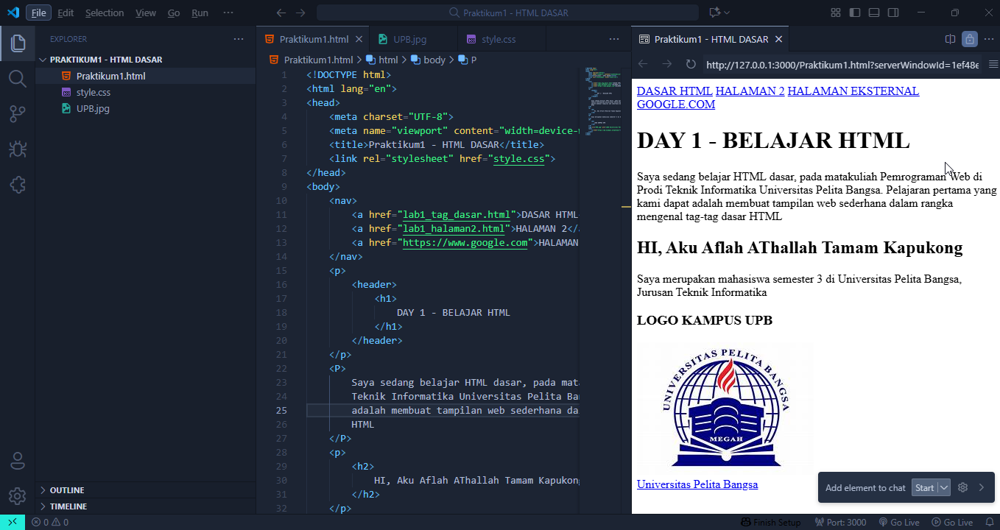

# MEMBUAT MODUL PRAKTIKUM PEMROGRAMAN WEB

NAMA : AFLAH ATHALLLAH TAMAM KAPUKONG

NIM : 312410280

KELAS : TI.24.A.4

MATKUL : PEMROGRAMAN WEB 1

# Praktikum 1 - HTML Dasar

Ini adalah hasil praktikum pertama mata kuliah **Pemrograman Web** di Prodi Teknik Informatika Universitas Pelita Bangsa.  
Berikut kode HTML dasarnya:

```html
<!DOCTYPE html>
<html lang="en">
<head>
    <meta charset="UTF-8">
    <meta name="viewport" content="width=device-width, initial-scale=1.0">
    <title>Praktikum1 - HTML DASAR</title>
    <link rel="stylesheet" href="style.css">
</head>
<body>
    <nav>
        <a href="lab1_tag_dasar.html">DASAR HTML</a>
        <a href="lab1_halaman2.html">HALAMAN 2</a>
        <a href="https://www.google.com">HALAMAN EKSTERNAL GOOGLE.COM</a>
    </nav>
    <header>
        <h1>DAY 1 - BELAJAR HTML</h1>
    </header>
    <p>
        Saya sedang belajar HTML dasar, pada matakuliah Pemrograman Web di Prodi
        Teknik Informatika Universitas Pelita Bangsa. Pelajaran pertama yang kami dapat
        adalah membuat tampilan web sederhana dalam rangka mengenal tag-tag dasar
        HTML
    </p>
    <h2>HI, Aku Aflah Athallah Tamam Kapukong</h2>
    <p>
        Saya merupakan mahasiswa semester 3 di Universitas Pelita Bangsa, Jurusan Teknik Informatika
    </p>
    <h3>LOGO KAMPUS UPB</h3>
    
    <nav>
        <a href="https://pb.ecampus.id/pb/main">Universitas Pelita Bangsa</a>
    </nav>
</body>
</html>

1. Bagian Struktur Awal (Deklarasi + Tag <html>)

<!DOCTYPE html>
<html lang="en">

<!DOCTYPE html> → Memberitahu browser bahwa ini adalah dokumen HTML5.
<html lang="en"> → Elemen utama HTML, dengan atribut lang="en" artinya bahasa utama dokumen English (bisa diganti id untuk Indonesia).

2. Bagian <head> (Informasi Dokumen)
<head>
    <meta charset="UTF-8">
    <meta name="viewport" content="width=device-width, initial-scale=1.0">
    <title>Praktikum1 - HTML DASAR</title>
    <link rel="stylesheet" href="style.css">
</head>
<meta charset="UTF-8"> → Supaya teks bisa menampilkan semua karakter (huruf, simbol, dll).
<meta name="viewport"...> → Membuat tampilan responsive di HP/laptop.
<title> → Judul halaman, muncul di tab browser.
<link rel="stylesheet" href="style.css"> → Menghubungkan file CSS eksternal.

🔹 3. Bagian <body> (Isi Halaman)
<body>
    <nav>
        <a href="lab1_tag_dasar.html">DASAR HTML</a>
        <a href="lab1_halaman2.html">HALAMAN 2</a>
        <a href="https://www.google.com">HALAMAN EKSTERNAL GOOGLE.COM</a>
    </nav>
<body> → Semua isi halaman web ada di sini.
<nav> → Navigasi (menu).
<a href="..."> → Link:
lab1_tag_dasar.html → ke file lokal.
lab1_halaman2.html → ke halaman lokal lain.
https://www.google.com → ke website eksternal.

🔹 4. Bagian Judul Halaman
    <header>
        <h1>DAY 1 - BELAJAR HTML</h1>
    </header>
<header> → Bagian kepala halaman.
<h1> → Judul utama.

🔹 5. Bagian Paragraf Penjelasan
    <p>
        Saya sedang belajar HTML dasar, pada matakuliah Pemrograman Web di Prodi
        Teknik Informatika Universitas Pelita Bangsa. Pelajaran pertama yang kami dapat
        adalah membuat tampilan web sederhana dalam rangka mengenal tag-tag dasar
        HTML
    </p>
<p> → Menampilkan teks dalam bentuk paragraf.

🔹 6. Bagian Perkenalan
    <h2>HI, Aku Aflah Athallah Tamam Kapukong</h2>
    <p>
        Saya merupakan mahasiswa semester 3 di Universitas Pelita Bangsa, Jurusan Teknik Informatika
    </p>
<h2> → Sub-judul lebih kecil dari <h1>.
<p> → Paragraf penjelasan tambahan.

🔹 7. Bagian Logo Kampus
    <h3>LOGO KAMPUS UPB</h3>
    
<h3> → Judul lebih kecil dari <h2>.
 → Menampilkan gambar UPB.jpg dengan teks alternatif jika gambar tidak ditemukan.

🔹 8. Bagian Link Tambahan
    <nav>
        <a href="https://pb.ecampus.id/pb/main">Universitas Pelita Bangsa</a>
    </nav>
</body>
</html>
<a href="..."> → Link ke website e-campus UPB.
</body> → Penutup isi halaman.
</html> → Penutup dokumen HTML.


